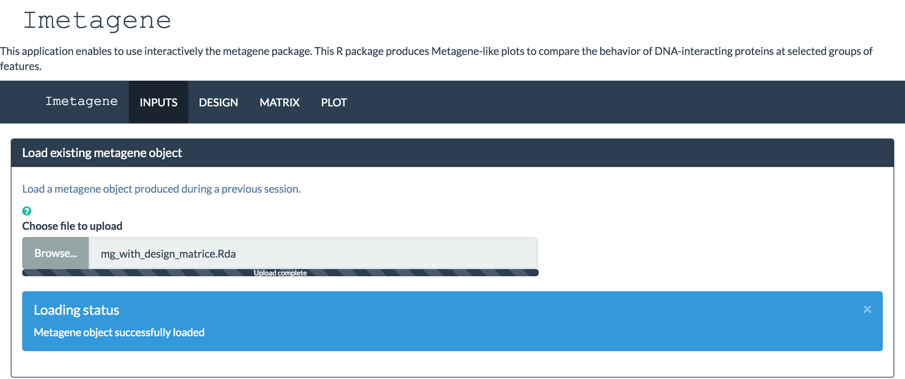
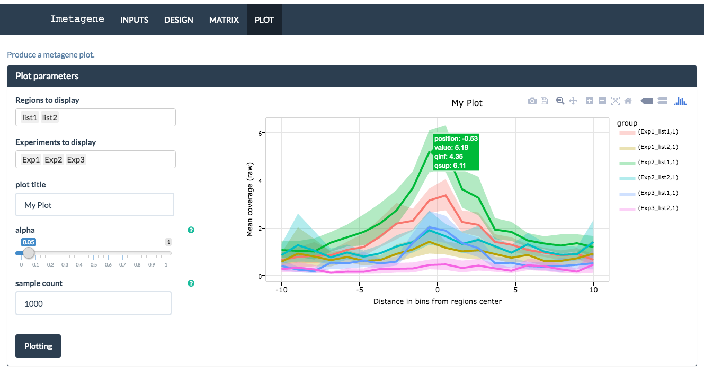

```{r style, echo = FALSE, results = 'asis', message = FALSE}
BiocStyle::markdown()
library(knitr)
```

**Package**: `r Biocpkg("Imetagene")`<br />
**Authors**:
`r eval(parse(text = packageDescription("Imetagene")[["Author@R"]]))`<br />
**Modified**: 9 october, 2015<br />
**Compiled**: `r date()`<br />
**License**: `r packageDescription("Imetagene")[["License"]]`<br />

# Introduction
Imetagene is a graphical user interface for metagene that is based on the shiny 
package and is displayed in a web browser. <br/>
This interface is based on the last version of metagene (>= 2.1.31). <br/>

Metagene package "produces metagene-like plots to compare the behavior of
DNA-interacting proteins at selected groups of features. A typical analysis
can be done in vicinity of transcription start sites (TSS) of genes or at any
regions of interest (such as enhancers). Multiple combinations of group of
features and/or group of bam files can be compared in a single analysis.
Bootstraping analysis is used to compare the groups and locate regions with
statistically different enrichment profiles. In order to increase the
sensitivity of the analysis, alignment data is used instead of peaks produced
with peak callers (i.e.: MACS2 or PICS). The metagene package uses bootstrap
to obtain a better estimation of the mean enrichment and the confidence
interval for every group of samples." - 
(<a href="http://bioconductor.org/packages/release/bioc/vignettes/metagene/inst/doc/metagene.html">go to metagene vignette</a>)

Using this interface you can easily load your files (BAM et BED), 
build your experimental design, generate your coverage matrices and finally plot 
your metagene-like plots.<br />

# Organization overview
The interface is divided in four parts : **Inputs**, **Design**, **Matrix** and 
**Plot**. <br />
A classical usage of the interface would be to first fill the Inputs part.

Once the input is filled, you can build your experimental design in the 
Design section. Thanks to the design option, multiple combinations of group of 
bam files can be compared in a single analysis.

You can then generate the coverages matrices according to the design if given in
the Matrix panel. <br />
Finally, the metagene plot are produced using the `ggplot2` package in the Plot 
part.

## Inputs
You can work with an existing metagene object previously generated by metagene 
(>= 2.1.31) or through Imetagene. The file must be a RData file (with extention 
.RData, .Rda, .RDATA or .RDA)<br />



You also create a new metagene object. To do so, you have to provide the BAM 
files you want to use and the regions you want to study in BED format.

There is no hard limit in the number of BAM files that can be included in an 
analysis (but with too many BAM files, memory may become an issue). 
BAM files must be indexed. For instance, if you use a file names file.bam, 
a file named file.bam.bai must be present in the same directory.

To compare custom regions of interest, it is possible to use a list of one or 
more BED files. BED, narrowPeak and broadPeak format are supported 
(extention .bed, .BED, .narrowPeak and .broadPeak).


You can then save the metagene object for a future usage.
Once the metagene is loaded or freshly created, you can go to the next step : 
`Design` creation.

## Design

A design file is a tab-delimited file (.tsv) that describes one or more 
experiments. An experiment can contain one or more replicates and controls. 
The first column of a design file contains the list of bam names available in 
the current metagene object. The following columns correspond to the 
experiments. They must have a unique name and the possible values are 
0 (ignore), 1 (chip) or 2 (control).

If you are using a loaded metagene object which already contains a design, 
it will be displayed in the `Current design` tab. If you load or create a new 
design it will override the existing one.

You can load an existing design file in the `Load existing design file` tab. 
If the file is well formated, it will be loaded and displayed the 
`Current design` tab. <br/>


To create a new design, you can go in the `Create new design` tab. You will have 
create one experiment at a time by :

* defining an experiment name (must be unique in the design, or it will override
the homonym experiment)
* selecting the chip among the BAM files
* selecting the corresponding control among the remaining BAM files (optional)


Once it is done, you can add the experiment. The updated design will be 
displayed the `Current design` tab.


You can then save the design in csv file for a further use.

## Matrix
To produce the metagene plot, the coverages must be converted in a matrix where
the columns represent the positions and the rows the regions. Furthermore, to
reduce the computation time during the following steps, the positions are also
binned.

If you are using a loaded metagene object which already contains processed 
matrices, they will be displayable in the `Current matrix subset` tab. 
If you produce new matrices, they will override the existing ones.

We can control the size of the bin either with the `bin_size` argument. 
By default, a `bin_count` of 100 will be used during this step.

We can also use the design we produced earlier to remove background signal and
combine replicates.


The `Current matrix subset` tab give you an overview of the generated matrices 
as heatmaps. Thanks to the package `d3heatmap`, you can hover the mouse pointer 
over a cell to show details, drag a rectangle to zoom, and click row/column 
ticks to highlight.


You can then save the updated metagene object (which now contains a design and 
matrices) for a future usage.


## Plot

The metagene plot requires a `data.frame` as input. The `data.frame` is computed 
in background and the values of the ribbon are calculated.
By default, metagene uses "bootstrap" to obtain a better estimation of the
mean of enrichment for every positions in each group of regions/BAM files.

The `data.frame` will be then used to plot the calculated
values using `ggplot2`. We show a subset of the regions by using the
`Regions to display` and `Experiments to display` parameter. 
The `Regions to display` correspond to the names of the regions used during the 
initialization. The `Experiments to display` will vary depending if a design was
added. If no design was added, this param correspond to the BAM name or BAM 
filenames. Otherwise, we have to use the names of the columns from the design.

Here is the plot with the usage of a design




And the same data without a design


